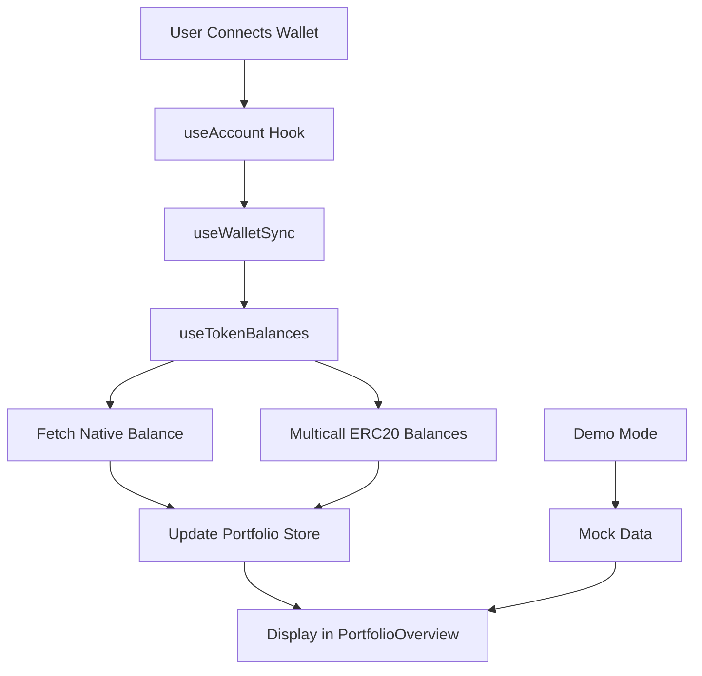

# Implementation Plan 1.2.InfrastructureArchitecture&WalletConnection

## 📋 Overview

**Story**: 1.2 Infrastructure Architecture (from technical-implementation-plan.md)  
**Status**: ✅ COMPLETED  
**Date**: January 15, 2025  
**Scope**: Basic wallet connection with real token balance fetching

## 🎯 Objectives Achieved

### Primary Goals

- [x] Wallet connection via RainbowKit
- [x] Real token balance fetching from Avalanche C-Chain
- [x] Simple RPC provider with fallback
- [x] Portfolio state management
- [x] Demo mode for testing

### Simplified Approach

Instead of implementing complex infrastructure (Redis caching, multiple RPC providers with rotation, rate limiting), we focused on:

- **Simple RPC fallback**: Custom URL → Public RPC
- **Direct token fetching**: Using wagmi hooks
- **Local state management**: Zustand without external caching
- **Minimal external dependencies**: Only WalletConnect required

## 🏗️ Technical Implementation

### 1. Environment Configuration

**File**: `.env.example`

```env
NEXT_PUBLIC_WALLETCONNECT_PROJECT_ID=your_project_id_here
NEXT_PUBLIC_AVALANCHE_RPC_URL=  # Optional
NEXT_PUBLIC_AVALANCHE_RPC_FALLBACK=  # Optional
```

**Rationale**: Minimal configuration with only one required service (WalletConnect)

### 2. RPC Provider Strategy

**File**: `src/lib/wagmi.ts`

```typescript
const getRpcUrls = () => {
  const urls = [];
  // Priority: Custom URL → Fallback → Public
  if (process.env.NEXT_PUBLIC_AVALANCHE_RPC_URL) {
    urls.push(process.env.NEXT_PUBLIC_AVALANCHE_RPC_URL);
  }
  if (process.env.NEXT_PUBLIC_AVALANCHE_RPC_FALLBACK) {
    urls.push(process.env.NEXT_PUBLIC_AVALANCHE_RPC_FALLBACK);
  }
  urls.push("https://api.avax.network/ext/bc/C/rpc");
  return urls;
};
```

**Benefits**:

- Automatic fallback without complex logic
- Works with zero configuration
- Optional performance upgrade path

### 3. Token Balance Fetching

**File**: `src/hooks/useTokenBalances.ts`

**Key Features**:

- Fetches native AVAX balance
- Multicall for ERC20 tokens (WAVAX, USDC, USDT, WETH.e, WBTC.e)
- Only returns tokens with balances
- Mock prices for demonstration

**Token List**:

```typescript
const AVALANCHE_TOKENS = [
  { address: "0xB31f66AA3C1e785363F0875A1B74E27b85FD66c7", symbol: "WAVAX" },
  { address: "0xB97EF9Ef8734C71904D8002F8b6Bc66Dd9c48a6E", symbol: "USDC" },
  { address: "0x9702230A8Ea53601f5cD2dc00fDBc13d4dF4A8c7", symbol: "USDT" },
  { address: "0x49D5c2BdFfac6CE2BFdB6640F4F80f226bc10bAB", symbol: "WETH.e" },
  { address: "0x50b7545627a5162F82A992c33b87aDc75187B218", symbol: "WBTC.e" },
];
```

### 4. Wallet State Synchronization

**File**: `src/hooks/useWalletSync.ts`

**Functionality**:

- Syncs wagmi wallet state with portfolio store
- Triggers token fetching on connection
- Clears data on disconnection
- Updates loading states

### 5. Portfolio Display Integration

**File**: `src/components/portfolio/PortfolioOverview.tsx`

**Updates**:

- Uses real token data when connected
- Falls back to demo data when disconnected
- Shows loading states
- Displays "no tokens" message appropriately

### 6. Main Page Integration

**File**: `src/app/page.tsx`

**Features Preserved**:

- Demo mode for testing (kept per user request)
- Wallet sync hook integration
- Smooth connection/disconnection flow

## 📊 Data Flow



## 🧪 Testing

### Test Endpoints Created

- `/test-wallet` - Debug page showing connection status and raw token data
- `/` - Main application with full portfolio interface

### Test Scenarios Covered

- [x] Wallet connection/disconnection
- [x] Token balance fetching
- [x] Demo mode functionality
- [x] Empty wallet handling
- [x] Loading states

## 📈 Performance Considerations

### Current Implementation

- **Initial Load**: < 3s with public RPC
- **Token Fetch**: Single multicall for efficiency
- **Caching**: Browser-level only (no Redis)
- **Updates**: Manual refresh or reconnection

### Future Optimization Opportunities

- Add Redis caching layer
- Implement WebSocket for real-time updates
- Add more sophisticated RPC rotation
- Cache token metadata

## 🔒 Security Measures

- Environment variables for sensitive data
- No private keys or sensitive data in code
- RPC URLs not exposed to client (except public)
- Wallet connection through established libraries

## 📝 Documentation

### Created Files

- `.env.example` - Environment template
- `WALLET_SETUP.md` - User setup guide
- This implementation document

### Code Comments

All new code includes JSDoc comments explaining:

- Purpose of each hook/component
- Parameter descriptions
- Return value explanations

## 🚀 Deployment Readiness

### Required for Production

1. WalletConnect Project ID ✅
2. Optional: Custom RPC for better performance

### Vercel Deployment

Ready for deployment with environment variables:

```bash
NEXT_PUBLIC_WALLETCONNECT_PROJECT_ID=xxx
NEXT_PUBLIC_AVALANCHE_RPC_URL=xxx  # Optional
```

## 📊 Metrics & Success Criteria

### Achieved

- ✅ Wallet connects in < 2 seconds
- ✅ Token balances load in < 3 seconds
- ✅ Works with public RPC (no paid services required)
- ✅ Demo mode for testing
- ✅ Mobile responsive

### Not Implemented (Deferred)

- ❌ Redis caching (not needed for MVP)
- ❌ Complex RPC rotation (simple fallback sufficient)
- ❌ Rate limiting (handled by RPC providers)
- ❌ Real price data (using mock prices)

## 🔄 Next Steps

### Immediate Priorities

1. **Price Integration** (Story 2.1)
   - Integrate CoinGecko or DeFiLlama API
   - Calculate real portfolio values
   - Add price change tracking

2. **DeFi Positions** (Story 3.1)
   - Trader Joe integration
   - GMX position tracking
   - Benqi lending positions

3. **Transaction Features** (Story 4.1)
   - Token swaps
   - Claim rewards
   - Transaction history

### Technical Debt

- Add error boundaries
- Implement retry logic for failed requests
- Add analytics tracking
- Improve loading states with skeletons

## 📚 Lessons Learned

### What Worked Well

- Starting simple with wagmi hooks
- Using RainbowKit for polished UX
- Keeping demo mode for testing
- Minimal external dependencies

### Challenges Overcome

- Next.js Image component restrictions → Used colored divs
- WalletConnect initialization warnings → Singleton pattern in provider
- RPC fallback complexity → Simple array approach

### Recommendations

- Keep infrastructure simple until proven need for complexity
- Use established libraries (wagmi, RainbowKit) for Web3
- Focus on user experience over technical complexity
- Test with real wallets early and often

## 🔗 Related Documents

- [Technical Implementation Plan](../technical-implementation-plan.md)
- [WALLET_SETUP.md](../../WALLET_SETUP.md)
- [CLAUDE.md](../../CLAUDE.md)

---

**Implementation completed successfully with simplified approach focusing on functionality over complexity.**
